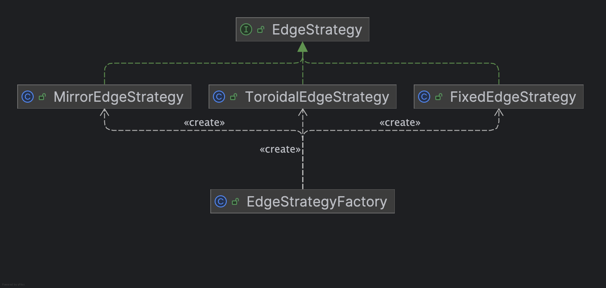
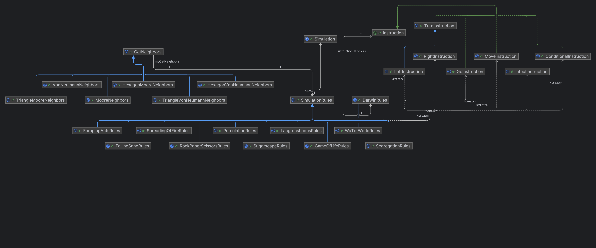
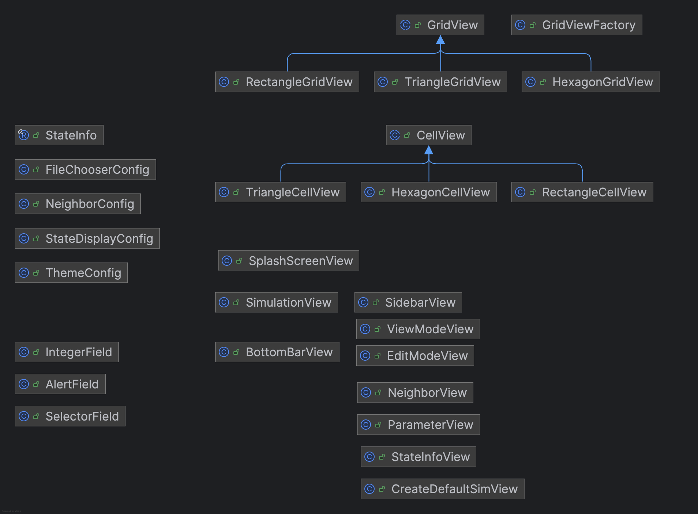

# Cellular Automaton Simulator

## Team Number 4

### By: Owen Jennings, Justin Aronwald, Troy Ludwig

This project implements a cellular automata simulator.

### Timeline

* Start Date: January 28th, 2025

* Finish Date: March 4th, 2025

* Hours Spent: 220+ hours

### Attributions

* Resources used for learning (including AI assistance)
    - Java and JavaFX documentation
    - ChatGPT for assistance in learning new concepts and refactoring code based on design
      requirements.

* Resources used directly (including AI assistance)
    - We used ChatGPT for assistance in writing and refactoring code throughout the project.
      Whenever ChatGPT generated code that we copied or slightly modified, we included a comment in
      the file to indicate that it was used.
    - The UI styles.css file was heavily influenced
      by : https://github.com/antoniopelusi/JavaFX-Dark-Theme
    - For understanding falling sand rules: https://www.youtube.com/watch?v=5Ka3tbbT-9E

### High level UML diagrams showcasing our model and view classes.

### Running the Program

* Main class: Main.java

* Data files needed:
    * All required Data files can be found in the main resources directory.
        * Optional cell state color properties can be found in the property file
          `/resources/cellsociety/colors/CellColors.properties`
            * If a color is not defined in this properties file, a random color will be assigned to
              a state when the simulation is first opened
    * Darwin instructions are stored in the
      `/resources/cellsociety/darwin instructions/DInstructions.properties`
    * The required fonts for the UI are found in the `/resources/cellsociety/fonts/` directory. Any
      ttf font can
      be used, so long as there is a file named bold.ttf and regular.ttf for the bold and regular
      font.
    * All of the support languages are stored in `/resources/cellsociety/languages`. By default,
      there is an
      English, PigLatin, and Spanish language file. To create a new language, see CREATE_LANGUAGE.md
      in this directory.
    * The default themes are included in the `/resources/cellsociety/themes/`. To create a custom
      theme, create a CSS file in this directory, following the guide in CREATE_THEME.md
    * The file `/resources/cellsociety/styles.css` contains all the common styles that are shared
      across all themes.
    * The file `/resources/log4j2.xml` is required to properly configure the Log4j2 logging that is
      utilized by this program.
    * The file `/resources/cellsociety/default.xml` is the required default simulation file. This is
      used primarily for testing and to prevent any null pointer exceptions when creating the
      initial UI elements.

* Interesting data files:
    * All of our custom example xml files can be found in the `/resources/simulations` directory.
      This directory contains examples for each of the simulation types, the different cell shapes,
      different edge types, randomly created simulations, and examples with missing or invalid
      files.

* Key/Mouse inputs:
* The user can interact with the UI via multiple clearly labeled buttons, selector fields,
  checkboxes, and text input fields. If the program has more content that what can be viewed in the
  main window, a scroll bar will be created, allowing the user to scroll to view the remaining
  content.
* You can click on a cell in the simulation to get information about it in the view mode or to
  change its state in the edit mode.
* You can change the zoom of the simulation grid, by putting your mouse in the grid area and swiping
  with 2 fingers on the trackpad at once. To reset the zoom to the default, you can click the reset
  zoom button on the sidebar.

### Notes/Assumptions

* Assumptions or Simplifications:
    * The state of a simulation is stored as an integer value.
        * The default state for a simulation is assumed to be 0 and simulation states are a positive
          integer value.
        * The number of states method lets the front end know how many states to expect. For
          example, if the number of states is 3, then the valid states should be 0 (default), 1, 2.
    * We assumed the typical usage of Percolation such that water flows from the top and only
      considers the adjacent neighbors (not the diagonals).
    * In WaTor World, we assumed that the sharks will be processed first, so if a shark moves to a
      cell before a fish moves, the fish will be removed and will not have the opportunity to move.
      Thus, we process sharks first, then as long as the fish cells are untouched, we move those to
      new cells.
    * Reproduction of sharks and fish occurs one iteration after there reproduction time has passed.
      For example, if the reproductive time of a shark is set to 2, then it will move around for its
      first 2 iterations of life and then reproduce on its third iteration/step of life.
    * For RockPaperScissors, we assumed that for any x number of states, the current state will lose
      to the n/2 numbers before it, and beat the n/2 winners ahead of it (in the circular route).
      Furthermore, to determine the next state of a cell, if more than 1 cell are above the
      threshold, we will update the cell with the furthest winning cell. By this, we mean that in
      the n/2 cells that beat the current state, we will take the furthest cell from the current
      state.

    * We assumed the typical usage of Percolation such that water flows from the top and only
      considers the adjacent neighbors (not the diagonals).
    * In WaTor World, we assumed that the sharks will be processed first, so if a shark moves to a
      cell before a fish moves, the fish will be removed and will not have the opportunity to move.
      Thus, we process sharks first, then as long as the fish cells are untouched, we move those to
      new cells.
    * We assumed that the grid state should only be modifiable when the user is in our "edit mode,"
      so that users do not unintentionally modify the simulation. However, only a single if
      statement would need to be changed to allow grid state updating while the simulation is
      running.
    * In Foraging Ants, we assume there can only be one ant per state and that ants cannot travel in
      a diagonal path. Ants are produced from ant hills after a number of turns specified by the
      user.
    * In Falling Sand, if a sand cell is able to moved directly down, it will automatically move
      down. If it can only move to its left or right diagonal, it will randomly choose one of the
      diagonals if both of them are empty. If only one diagonal is empty and it cannot fall directly
      down, it will move to the only open diagonal.
    * In Sugarscape, an agent's metabolism will always be subtracted before checking its neighbors.
      Thus, it must have sufficient metabolism prior to movement. Then, it determines the maximum
      sugar patch within its vision. It breaks ties using a minimum distance.
    * The tooltip feature to show the state for a given cell will only be displayed when the
      animation is not running and when the user is not in edit mode. This is to not annoy the user
      of the tool tip constantly showing when they put their mouse in the grid area.
    * In Darwin, we assume that for each move instruction, each pixel represents one block in our
      simulation. So, for example, a MOVE 4, will move 4 blocks, rather than simply four pixels. We
      also assume that degrees will get rounded to the nearest 45 degree. So if, somebody inputs
      something like 30 degrees, we round that handle the orientation differently depedning on if
      the neighbor configuration is Moore or Von Neumann. So, for 30 degrees and 0 degree initial
      orientation, a right turn for Moore rounds to 45 degrees, while a right turn for Von Neumann
      rounds to 0 degrees.

* Known Bugs:
    * For Hexagon and Triangle shapes, there may be slight gaps in between the shapes, due to
      rounding
      of double values for their location. This may make it appear like there are grid lines even
      when grid lines is disabled.
    * Sometimes when changing the theme, some of the text in the UI has an update glitch where the
      text alignment shifts from centered to right or left aligned.

* Features implemented:
    * Every core feature from the initial project, to the general and robustness phase, to the
      change phase were completed.
    * Of the variations for the General/Robustness phase, we completed:
        * For Feature 26:
            * We implemented CELL-26A, 26B, 26C, 26D, 26E, and 26F
            * For the simulations with different presets, we chose the first one for each, so we
              could maximize the different simulation we created.
        * For Feature 32:
            * We implemented CEll 32A and 32B
        * For Feature 45:
            * We implemented CELL 45A, 45B, and 45C

    * Of the variations for the change phase, we completed:
        * For Feature 48:
            * We implemented CELL 48A and 48B
        * For Feature 49:
            * We implemented CELL 49A, 49B, and 49C. So, users can create any
              combination/configuration of neighborhood and layers to search for any simulation.
        * For Feature 50:
            * We implemented CELL 50A and 50B
            * What is unique about our implementation is that ou can assign neighborhood types like
              triangle to a hexagon grid etc. that allows you to do custom neighbor types even if
              the cell shape doesn’t reflect the neighborhood technique you want to use
        * For Feature 51:
            * We implemented CELL-51A, 51B, and 51C. All of this is located in our edit mode view.
        * For Feature 52/53:
            * We implemented the core 52, 53A, 53B, 53E,

* Features unimplemented:
    * We implemented all core + the variation features above.

* Noteworthy Features:
    * Our UI is a step above the requirement. We put a lot of time and effort into making sure the
      UI was super intuitive and easy to use.
    * We have a designated edit mode page that allows users to actively edit the simulation at that
      current moment. Users can change the cell states, modify the simulation data, or change the
      current configurations. This was created so that users don't inadvertently update the
      simulation when they don't want it to.
    * Users can create any simulation with any neighbor configuration, including both neighboring
      type and number of layers to look forward. This way, any simulation can be ran with any amount
      of layers and what not.
    * We added an extension Users can save the state of a program including preferred language,
      simulation speed, whether grid lines are enabled, preferred theme, etc, so that these details
      are saved when the user quits and reads in when the program restarts.
    * The config files requirements we went above and beyond on

### Assignment Impressions

* This project was a great way to improve our skills in Java, JavaFX, and refactoring and designing
  code.
* Having put in 220+ hours as a team, I think it's reasonable to say that this is a VERY time
  intensive project. This may not be feasible, but reducing the work load would have helped us.
* For receiving feedback, we would always receive it nearly a week later, when it was due. Thus, it
  would be much more useful if we could get the feedback sooner, so we could actually use it to
  improve out code.

