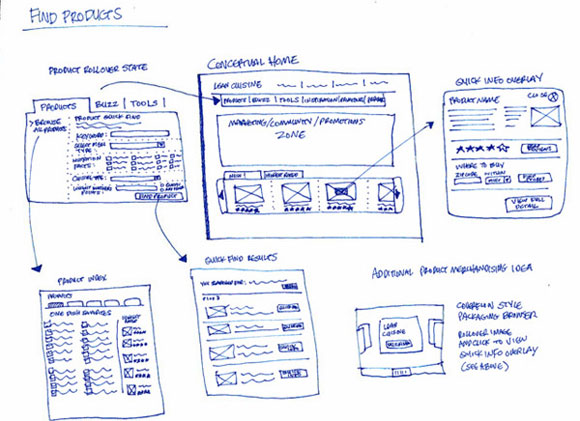

# Cell Society Design Plan
### Team Number: 4
### By: Owen Jennings (otj4), Justin Aronwald (jga18), Troy Ludwig (tdl21)

#### Examples

Here is a graphical look at my design:

made from [a tool that generates UML from existing code](http://staruml.io/).

Here is our amazing UI:

taken from [Brilliant Examples of Sketched UI Wireframes and Mock-Ups](https://onextrapixel.com/40-brilliant-examples-of-sketched-ui-wireframes-and-mock-ups/).

## Overview
Through this project, our team hopes to create an interactive Cellular Automata simulations. Our program will allow for multiple different simulation types configured by formatted XML files. The program will begin by prompting the user to select a simulation file to load, which runs the simulation on load. The application will show a grid view that animates (steps through) each predetermined time step. 
Our main goals include a functional simulation created by proper encapsulated code and abstraction. We hope to build on the skills developed in class and work on effectively modularizing the code. We want the design to be flexible in the sense that new simulations added are easily loaded and new user features are easily integrable.    

At a high level, we know that we are going to include a hierarchy for the grid. The cell class will be abstracted to handle the various cell cases. We are going to ensure proper separation between the UI elements and the translation of files into the grid-like system. Broadly, each cell is going to have methods for updating its state and relations to its neighbors.

In terms of high level flow, users are going to input an XML file with the grid coordination. Then, each cell's status will be determined by a set of rules predefined for that specific simulation. Then, each cell will be processed and the grid will be updated to accommodate each of the cell changes. Finally, the UI will be updated to display the changes to the user.

## User Interface

We created a user interface design using Figma:

To view our Figma UI design online visit this link: [https://www.figma.com/design/fb8PYecEdF8yTVQFFQ9pHn/Untitled?node-id=0-1&t=o72ftO1mXizAi2pu-1](https://www.figma.com/design/fb8PYecEdF8yTVQFFQ9pHn/Untitled?node-id=0-1&t=o72ftO1mXizAi2pu-1)

Our program will have an alert popup telling the user if there is any issues with the program.
It will display a message like "File Not Found", "Incorrect XML File Format", "Invalid User Input", "Error ...", to alert the user whenever the program runs into an error.

## Configuration File Format
For the XML file, we want tags that will specifically configuration a variety of simulation environments. These tags should include:
* Simulation type: the name of the simulation that represents a set of rules
* Simulation title: a name for the specific starting configuration
* Simulation author: who wrote this starting configuration
* Simulation description: what you expect to see or why you find this configuration interesting
* Grid dimensions: height and width of the grid
* Initial configuration states: what action is every cell taking at the beginning (ie. dead or alive, burning or empty, etc.)
* Specific parameter values: any extra information required by the defined simulation type (ie. burning propability for Fire and nothing for Game of Life.)

Link to example 1: [Example 1](../data/ExampleXMLs/Example1.xml)

Link to example 2: [Example 2](../data/ExampleXMLs/Example2.xml)

## Design Overview
The abstractions we hope to create are the following:
* **Simulation class** - holds the rules for each simulation
  * This abstract class will be implemented by each type of simulation created (i.e Game of Life) containing the rules for that game
  * **Collaboration:** the simulation class will interact with the Grid class to iterate through the Cell classes and update statuses. It will also likely interact with XML files to load the simulation paramters

The other classes include:
* **Grid class** - the 2D grid of cells
  * Manages the data structure that we will use to hold the 2D grid as well as reference  
  * **Collaboration:** the grid class will interact with the Cell class to update states
* **Cell class** - each cell represented on the grid
    * Each of the cells are going to maintain their current state
    * **Collaboration:** the cell class will interact with its neighbors (other instances of the Cell class)
* **View class** - represents the GUI for the user
  * Displays the grid and handles the user input
  * **Collaboration:** the view class will interact with the Simulation and Grid class to visualize the current state of the simulation
* **XMLHandler class** - handles the loading and saving of XML files
  * Parse the XML file to load the grid state and rules. Also handles the saving the current status back to an XML file
  * **Collaboration:** Takes and saves data from Simulation and Grid classes

## Design Details

## Use Cases

## Design Considerations

## Team Responsibilities

 * Team Member #1

 * Team Member #2

 * Team Member #3
